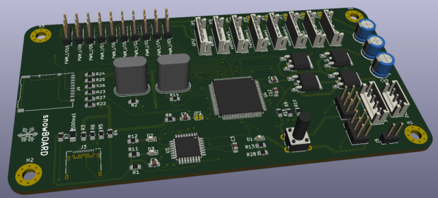
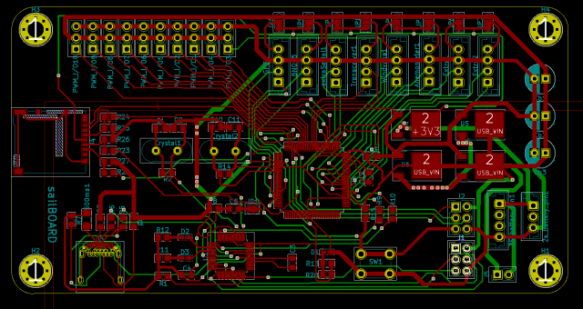
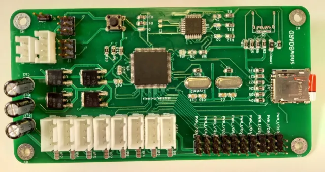
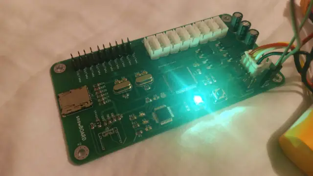

# SnowBOARD
This is an open-source prototyping module designed to simplify the development of embedded system projects by eliminating the need for soldering or complex wiring. It features dedicated connectors and ports that enable seamless peripheral connections with just a socket, requiring minimal wiring and no soldering. Additional functionalities include an SD card slot, a battery power management circuit, a USB Type-C interface, and a USB-to-UART converter, which facilitates USB debugging and firmware uploading.

    
    
    
    

